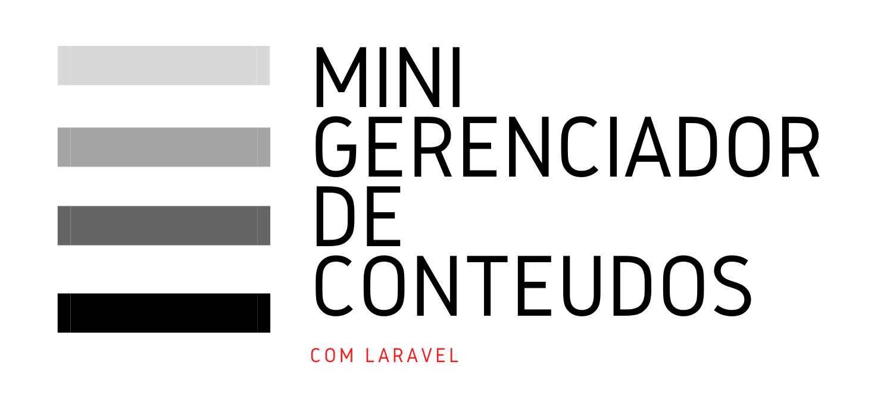

# Mini gerenciador de conteudos com Laravel

Essa aplicação tem como objetivo criar um gerenciador de conteudos que foi construida com as seguintes tecnologias:

- Laravel 8
- Docker
- Xampp

---

## Instalação com Xampp

### Requisitos

- Composer
- Xampp
- Node.JS

### Passos necessários:

- Colar o repositorio dentro da pasta htdocs do xampp

- Copiar o arquivo `.env.example` e mudar o nome para `.env`

- Copiar o arquivo `.env.dusk.example` e mudar o nome para `.env.dusk`

- Executar o comando `composer update`

- Executar o camando `npm install`

- Executar o comando `npm run watch` **(Ambiente de desenvolvimento)**

---
## Observações

Após os passos anteriores é necessário inserir algumas informações importante dentro do arquivo `.env`

|Váriavel  |Valor  |
|---------|---------|
|APP_URL     |(Insira url da aplicação )      |
|APP_KEY     |Execute o comando `php artisan key:generate`         |
|APP_ENV|(**local**: para ambiente de desenvolvimento, **production**: para ambiente de produção)|
|APP_DEBUG|(**true**: para ambiente de desenvolvimento, **false**: para ambiente de produção)|
|DB_CONNECTION     |mysql        |
|DB_HOST|mariadb|
|DB_PORT|3306|
|DB_DATABASE     |defina o nome desejado para a base de dados         |
|DB_USERNAME|defina o usuário desejado para a base de dados|
|DB_PASSWORD     |defina a senha desejada para a base de dados         |
|QUEUE_CONNECTION    |redis         |
|CACHE_DRIVER    |redis         |

## Observações

Após os passos anteriores é necessário inserir algumas informações importante dentro do arquivo `.env.dusk`

|Váriavel  |Valor  |
|---------|---------|
|APP_URL     |http://laravel.test      |
|APP_KEY     |Copie e cole o valor da variavel APP_KEY `.env`      |
|DEBUGBAR_ENABLED|false|

---
## Banco de dados

Depois de fazer as observações crie o banco de dados de acordo com as intruções

- No phpmyadimin ou no mysql crie um banco de dados com o nome do DB_DATABASE do arquivo `.env`
- Agora no editor de codigo dentro do terminal execute o comando `php artisan migrate`
- E execute o comando `php artisan db:seed` para criar 10 registros do banco de dados **(Opcional)**
- Pronto sua aplicação está funcionando

---

## Ultimos detalhes

Execute o comando `sail artisan storage:link` para linkar a pasta public dentro de storage para dentro da pasta public na raiz do projeto, assim o upload de arquivos estará funcionando perfeitamente.

## Portas da aplicação e rotas

|Porta  |Descrição  |
|---------|---------|
|80     |aplicação (http)      ||
|8025     |Mailhog (Dashboard)        |
|8081|redis Commander|
|localhost/horizon|Laravel Horizon|
|localhost/telescope| Laravel Telescope |

## Em desenvolvimento

